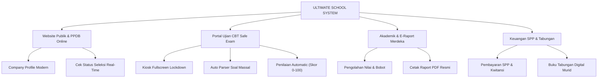
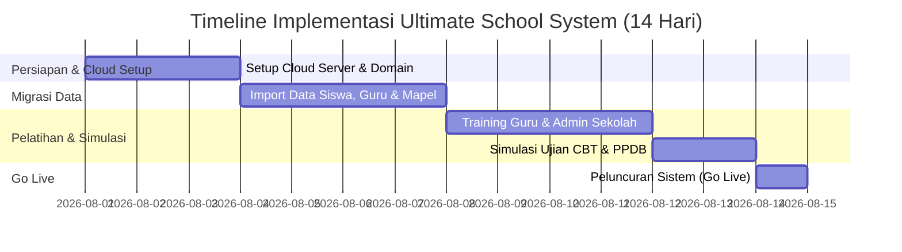

# PROPOSAL PENAWARAN KERJASAMA IMPLEMENTASI SISTEM INFORMASI MANAJEMEN SEKOLAH TERPADU (SIMS)
## **ULTIMATE SCHOOL SYSTEM**
*Solusi Digitalisasi Ekosistem Pendidikan Modern Berbasis Multi-Jenjang, Safe Exam CBT Anti-Kecurangan, dan E-Raport Kurikulum Merdeka*

---

### **SURAT PENGANTAR PENAWARAN**

**Hal** : Penawaran Kerjasama Implementasi Sistem Informasi Manajemen Sekolah (SIMS)  
**Lampiran** : 1 (Satu) Berkas Proposal Lengkap  

**Kepada Yth.**  
**Bapak/Ibu Kepala Sekolah & Pengurus Yayasan Pendidikan**  
Di Tempat  

Dengan hormat,  

Seiring pesatnya perkembangan teknologi informasi di era digital, efisiensi tata kelola administrasi sekolah, akurasi data akademik, serta keandalan sistem evaluasi belajar murid menjadi kunci utama peningkatan mutu dan reputasi sebuah lembaga pendidikan.  

Melalui surat ini, kami menghaturkan penawaran kerjasama implementasi **ULTIMATE SCHOOL SYSTEM** — sebuah Platform Sistem Informasi Manajemen Sekolah Terpadu (SIMS) generasi terbaru yang dirancang khusus untuk memenuhi kebutuhan operasional sekolah modern dari jenjang **SD, SMP, SMA, hingga SMK**.  

**ULTIMATE SCHOOL SYSTEM** menghadirkan integrasi tanpa batas antara **Website Sekolah Publik (Company Profile & PPDB Online)**, **Portal Akademik & E-Raport Kurikulum Merdeka**, **Safe Exam Engine CBT Anti-Kecurangan**, hingga **Manajemen Keuangan SPP & Tabungan Siswa** dalam satu platform yang responsif, aman, dan mudah digunakan.  

Besar harapan kami untuk dapat berdiskusi lebih lanjut dan mempresentasikan keunggulan sistem ini di hadapan Bapak/Ibu. Atas perhatian dan kesediaan waktu yang diberikan, kami ucapkan terima kasih.  

Hormat kami,  
**Tim Pengembang & Konsultan IT Ultimate School System**  

---

# TABLE OF CONTENTS / DAFTAR ISI

1. **EXECUTIVE SUMMARY (RINGKASAN EKSEKUTIF)**
2. **LATAR BELAKANG & PERMASALAHAN**
3. **SOLUSI ULTIMATE SCHOOL SYSTEM**
4. **FITUR & MODUL UNGGULAN SISTEM**
   - 4.1. Single-System Multi-Jenjang (SD, SMP, SMA, SMK)
   - 4.2. Website Public Company Profile & PPDB Online Integratif
   - 4.3. Engine Ujian CBT Safe Exam (Anti-Kecurangan & Kiosk Lockdown)
   - 4.4. Fast Copy-Paste Parser Soal & Kunci Jawaban Massal
   - 4.5. Bank Soal & Smart Question Recommendation Engine
   - 4.6. Manajemen Akademik & E-Raport Kurikulum Merdeka
   - 4.7. Sistem Pengumpulan Tugas & Absensi Digital
   - 4.8. Manajemen Keuangan, SPP & Tabungan Siswa
   - 4.9. Proteksi Keamanan Siber & Cloudflare Turnstile CAPTCHA
5. **SPESIFIKASI TEKNIS & KEAMANAN HASIL DIGITALISASI**
6. **SKEMA INVESTASI & PAKET LAYANAN**
7. **TIMELINE IMPLEMENTASI & PELATIHAN (TRAINING)**
8. **LAYANAN DUKUNGAN (AFTER-SALES & MAINTENANCE)**
9. **LEMBAR PERSETUJUAN KERJASAMA (SIGN-OFF SHEET)**

---

## 1. EXECUTIVE SUMMARY (RINGKASAN EKSEKUTIF)

**ULTIMATE SCHOOL SYSTEM** adalah platform Sistem Informasi Manajemen Sekolah (SIMS) berbasis web *enterprise-grade* yang dibangun menggunakan teknologi modern (PHP CodeIgniter 3, MySQL Enterprise, Bootstrap 5, AdminLTE 4, dan Cloudflare Turnstile Security).  

Sistem ini didesain untuk mentransformasi operasional sekolah dari cara-cara manual berbasis kertas menjadi ekosistem digital yang serba cepat, presisi, transparan, dan hemat biaya. 

### Highlight Keunggulan Utama:
- **Multi-Jenjang Dynamic Session**: 1 Aplikasi mampu mengelola multi-sekolah/jenjang (SD, SMP, SMA, SMK) dengan NPSN & Kepala Sekolah yang terpisah.
- **Safe Exam CBT Engine**: Ujian online dengan proteksi kecurangan *Fullscreen Lockdown*, deteksi pindah tab/aplikasi (*3-strike siren*), serta penilaian otomatis.
- **Fast Copy-Paste Question Parser**: Guru dapat menyalin puluhan soal + kunci jawaban dari Word/PDF dan diimpor otomatis dalam 2 detik.
- **Perlindungan Keamanan Tingkat Tinggi**: Dilengkapi Cloudflare Turnstile CAPTCHA & *Role-Based Access Control (ACL 7 Level Roles)*.
- **Desain Ultra-Responsive**: Berjalan sempurna di Komputer, Tablet, maupun Perangkat Mobile (iPhone & Android) tanpa geser/wobble horizontal.

---

## 2. LATAR BELAKANG & PERMASALAHAN

Banyak instansi sekolah saat ini menghadapi tantangan operasional berikut:
1. **Administrasi Terpisah-pisah**: Data siswa, keuangan, dan nilai tersimpan di file Excel yang rawan hilang atau tidak sinkron.
2. **Tingginya Risiko Kecurangan Ujian Online**: Murid dengan mudah membuka tab browser lain, Googling, atau menyalin jawaban saat ujian CBT biasa.
3. **Proses Pembuatan Soal CBT yang Memakan Waktu**: Guru merasa terbebani jika harus memasukkan butir soal pilihan ganda satu per satu secara manual.
4. **Proses PPDB yang Masih Manual**: Orang tua murid harus datang langsung untuk mendaftar dan mengecek status kelulusan.
5. **Pengolahan Raport Kurikulum Merdeka yang Rumit**: Perhitungan nilai akhir, capaian kompetensi, dan cetak e-raport sering menumpuk di akhir semester.

---

## 3. SOLUSI ULTIMATE SCHOOL SYSTEM

**ULTIMATE SCHOOL SYSTEM** memberikan solusi terpadu *all-in-one* yang menyelesaikan seluruh permasalahan di atas secara efisien:

---

## 4. FITUR & MODUL UNGGULAN SISTEM

### 4.1. Single-System Multi-Jenjang (SD, SMP, SMA, SMK)
- Mengelola data sekolah terpadu dengan dukungan switch mode jenjang (`SD`, `SMP`, `SMA`, `SMK`, atau `ALL`).
- Penyesuaian **NPSN** dan **Nama Kepala Sekolah** secara otomatis sesuai jenjang yang aktif.
- Hak akses menu switch mode hanya diberikan kepada Admin Sekolah & Super Admin.

### 4.2. Website Public Company Profile & PPDB Online
- **Modern Glassmorphic Landing Page**: Menampilkan Profil Sekolah, Visi-Misi, Sambutan Kepsek, Fasilitas, Ekstrakurikuler, dan FAQ.
- **Top Announcement Bar**: Pengumuman running text yang responsif di layar mobile.
- **Formulir PPDB Online Integratif**: Orang tua calon murid dapat mendaftar dari rumah.
- **Tracking Cek Status PPDB**: Pencarian real-time status kelulusan menggunakan Nomor Pendaftaran.

### 4.3. Engine Ujian CBT Safe Exam (Anti-Kecurangan)
- **Kiosk Fullscreen Lockdown**: Siswa diwajibkan masuk mode layar penuh sebelum memulai ujian.
- **3-Strike Violation Siren**: Merekam dan memberi peringatan otomatis jika siswa mencoba membuka tab lain, meminimize browser, atau menekan tombol F12/Alt+Tab/Ctrl+C/Ctrl+V.
- **Peta Navigasi Soal 5-Kolom Modern**: Menampilkan status soal (Hijau = Terjawab, Putih = Belum) beserta counter jumlah terjawab real-time.
- **Auto-Save Engine**: Setiap pilihan jawaban tersimpan secara otomatis ke database latar belakang.
- **Evaluasi Kelulusan Automatic**: Penilaian otomatis dengan standar KKM (Skor ≥ 60) dan penentuan status LULUS / BELUM LULUS.

### 4.4. Fast Copy-Paste Parser Soal & Kunci Jawaban Massal
- Guru/Admin cukup **Copy-Paste** naskah soal dari Microsoft Word / PDF langsung ke dalam sistem.
- Parser cerdas otomatis mendeteksi:
  - Teks wacana/bacaan pendukung.
  - Nomor soal & teks pertanyaan.
  - Pilihan jawaban A, B, C, D, E.
  - Kunci jawaban & pembahasan soal.
- Dilengkapi tombol **1-Click Insert Template** & **Salin Format Template**.

### 4.5. Bank Soal & Smart Question Recommendation Engine
- Repositori bank soal yang terstruktur per mata pelajaran dan kelas.
- Rekomendasi tingkat kesulitan soal (Mudah, Sedang, Sulit) yang beradaptasi dengan performa nilai murid sebelumnya.

### 4.6. Manajemen Akademik & E-Raport Kurikulum Merdeka
- Kelola Data Kelas, Mata Pelajaran, Jadwal Pelajaran, dan Wali Kelas.
- Input Nilai Akademik, Nilai Harian, UTS, dan UAS.
- Generasi dan Cetak Raport PDF Kurikulum Merdeka secara instan.

### 4.7. Sistem Pengumpulan Tugas & Absensi Digital
- Guru dapat membuat penugasan online dengan batas waktu (*deadline*).
- Siswa dapat mengunggah berkas tugas dan guru memberikan nilai serta umpan balik.
- Rekapitulasi absensi harian siswa dan guru.

### 4.8. Manajemen Keuangan, SPP & Tabungan Siswa
- Pembukuan pos pembayaran SPP dan biaya pendidikan lainnya.
- Pencetakan Kwitansi Pembayaran Resmi.
- Modul **Tabungan Digital Siswa** (Setor, Tarik, dan Rekap Saldo Real-Time).

### 4.9. Proteksi Keamanan Siber & Cloudflare Turnstile CAPTCHA
- Terintegrasi dengan **Cloudflare Turnstile CAPTCHA** pada halaman Login & PPDB untuk mencegah serangan bot/brute-force.
- **Role-Based Access Control (ACL)** dengan 7 Level Role:
  1. *Super Admin*
  2. *Admin Sekolah*
  3. *Kepala Sekolah*
  4. *Guru / Pengajar*
  5. *Wali Kelas*
  6. *Siswa / Murid*
  7. *Orang Tua Murid*

---

## 5. SPESIFIKASI TEKNIS & KEAMANAN

| Komponen | Spesifikasi & Teknologi |
| :--- | :--- |
| **Framework Core** | CodeIgniter 3 (PHP 7.4 / 8.x Ready) |
| **Database Engine** | MySQL Enterprise / MariaDB dengan Relasi FK & Indexing Fast-Query |
| **Front-End UI** | HTML5, JavaScript ES6+, Bootstrap 5, AdminLTE 4, CSS3 Custom Aesthetics |
| **Security Layer** | Cloudflare Turnstile, Password Hashing (Bcrypt/SHA256), CSRF Filter, SQL Injection Prevention |
| **Compatibility** | Desktop PC, Laptop, Tablet, Smartphone (iOS Safari & Android Chrome Responsive) |

---

## 6. SKEMA INVESTASI & PAKET LAYANAN

Kami menawarkan skema investasi yang fleksibel dan transparan sesuai skala instansi sekolah:

### **PAKET A: UTTIMATE PLATINUM (ALL-IN-ONE SOLUTION)**
> *Cocok untuk Yayasan / Sekolah Terpadu (SD + SMP + SMA/SMK)*

- **Cakupan**: 
  - Lisensi Full System Multi-Jenjang Unlimited User (Siswa, Guru, Wali Murid).
  - Domain `.sch.id` / `.com` + Cloud VPS Server Kinerja Tinggi (1 Tahun).
  - Setup Data Awal (Import Data Guru, Siswa, Kelas & Mapel).
  - Pelatihan (Training) Tatap Muka / Online untuk Guru & Staff Admin.
  - Pendampingan Pelaksanaan PPDB Online & Ujian CBT Pertama.
  - Garansi & Maintenance Sistem 1 Tahun.
- **Nilai Investasi**: **Rp 15.000.000,-** *(Satu Kali di Awal)*
- **Biaya Maintenance & Server Tahun Ke-2**: Rp 3.500.000,- / Tahun.

---

### **PAKET B: ULTIMATE STANDARD (SINGLE-JENJANG)**
> *Cocok untuk Instansi Sekolah Tunggal (Khusus SMP / Khusus SMA/SMK)*

- **Cakupan**: 
  - Lisensi Full System Single-Jenjang.
  - Hosting Cloud Performance + Domain Sekolah (1 Tahun).
  - Setup Data Awal & Training Penggunaan System.
  - Garansi & Support Maintenance 6 Bulan.
- **Nilai Investasi**: **Rp 9.500.000,-** *(Satu Kali di Awal)*
- **Biaya Maintenance & Server Tahun Ke-2**: Rp 2.000.000,- / Tahun.

---

## 7. TIMELINE IMPLEMENTASI & PELATIHAN

Implementasi sistem dilakukan secara terstruktur selama **14 Hari Kerja**:

---

## 8. LAYANAN DUKUNGAN (AFTER-SALES & MAINTENANCE)

Setiap implementasi **ULTIMATE SCHOOL SYSTEM** didukung oleh jaminan layanan:
1. **Garansi Bebas Bug**: Perbaikan kendala teknis / bug tanpa biaya tambahan selama masa garansi.
2. **Bantuan Layanan Support 24/7**: Layanan kendala cepat via WhatsApp Group & Remote Desktop (TeamViewer/AnyDesk).
3. **Pembaruan Sistem (System Update)**: Penyesuaian fitur secara berkala sesuai perkembangan regulasi Kurikulum Merdeka.

---

## 9. LEMBAR PERSETUJUAN KERJASAMA (SIGN-OFF SHEET)

Dengan ini menyatakan menyetujui Penawaran Kerjasama Implementasi **ULTIMATE SCHOOL SYSTEM** sesuai paket yang dipilih:

**Pilihan Paket yang Dipilih**:
[  ] Paket A: Ultimate Platinum (Multi-Jenjang All-In)  
[  ] Paket B: Ultimate Standard (Single Jenjang)  

---

**PIHAK FIRST (PENYEDIA SISTEM)**  
**Tim Ultimate School System**  

________________________  
**Nama**:  
**Jabatan**: IT Project Lead  
**Tanggal**: ____ / ____________ / 2026  

---

**PIHAK SECOND (INSTANSI SEKOLAH)**  
**[ Nama Instansi Sekolah / Yayasan ]**  

________________________  
**Nama**:  
**Jabatan**: Kepala Sekolah / Ketua Yayasan  
**Tanggal**: ____ / ____________ / 2026  
